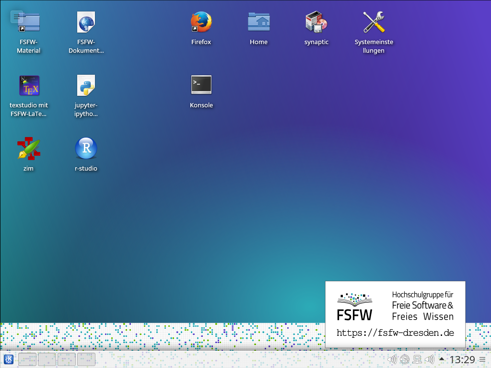
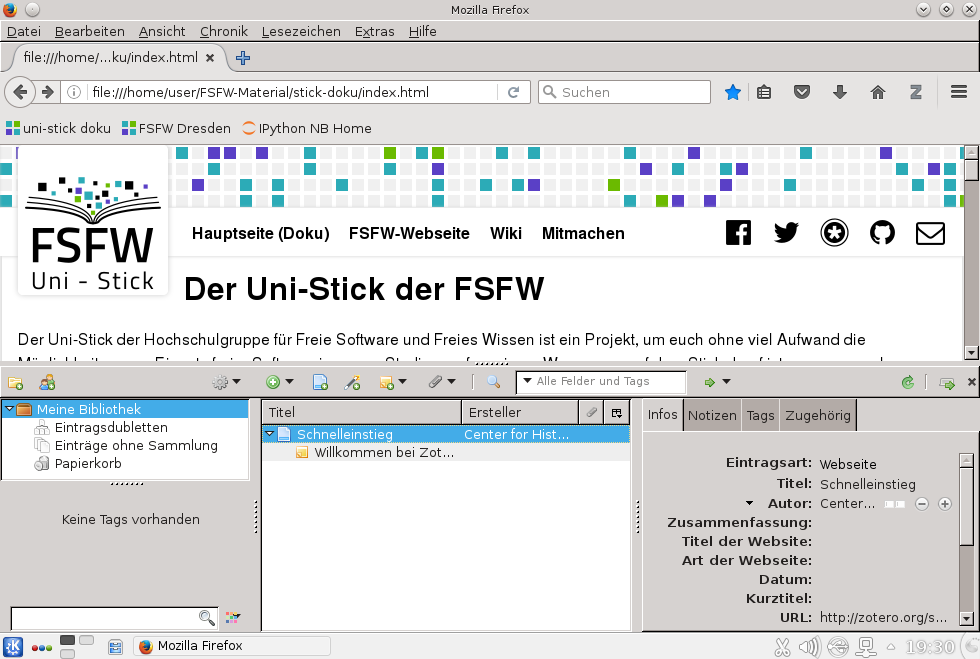
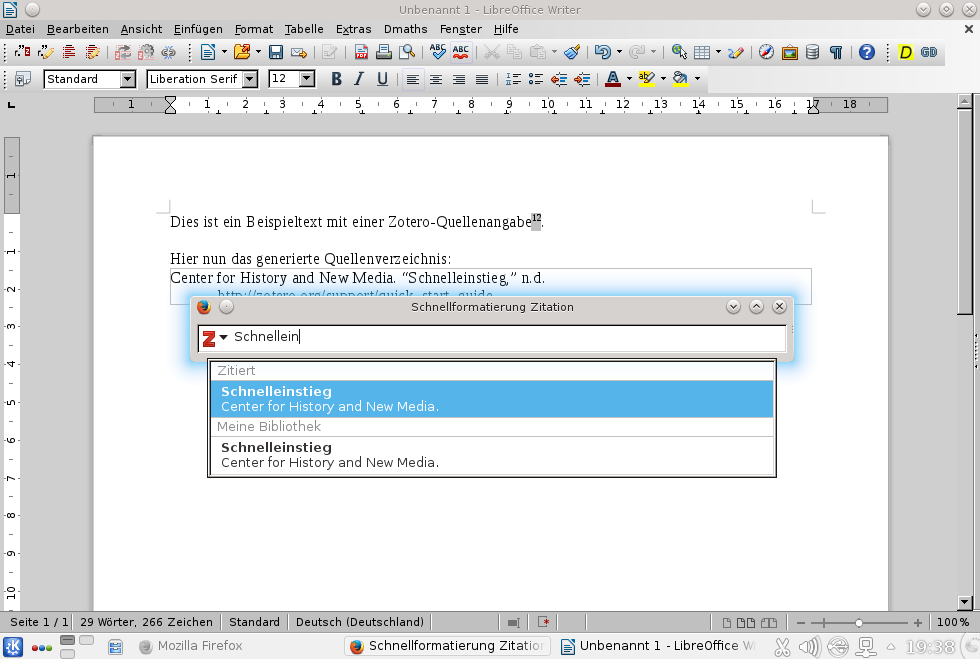
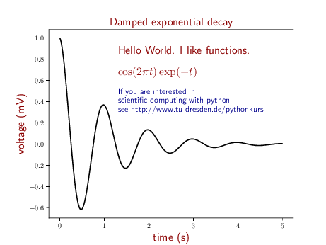

# FIXME: Outdated

Diese Datei definiert (auszugsweise) das von uns gewünschte Verhalten. Automatisierte Unittests wären deutlich eleganter sind aber technisch zu schwierig.
Jeder trägt die Programme und Funktionen ein, die er/sie für wichtig hält.

# Checkliste
## Desktop (Hintergrund und Symbole)

* Sollte ungefähr so aussehen: 
 * darauf achten, dass die Uni-Stick-spezifischen Programme räumlich von den allgemeinen Systemprogrammen getrennt sind.

## jupyter

* Klick auf Desktop-Verknüpfung "jupyter-ipython-notebook"; 5s warten
* Konsolenfenster geht auf und Firefox öffnet einen neuen Tab
 * Sieht so aus: 
* Das Beispiel-Notebook lässt sich starten
* Zellen lassen sich ohne Fehlermeldung ausführen (SHIFT + Enter)
* Sieht so aus (nur die ersten 2 Zellen ausgeführt): 

## zim

* Es ist eine Desktop-Verknüpfung dafür vorhanden
* Beim Starten wird die FSFW-zim-Vorlage geöffnet
* Sieht so aus: ![Screenshot]screenshot-zim-2017-02-15.jpg "zim Screenshot 1")
* Über das Menü: Einfügen -> Gleichung bzw. `ALT+E` `G` erreicht man den Dialog zum einfügen von LaTeX-Formeln
 * folgender String sollte ein sinnvolles Ergebnis liefern: `\alpha^2 + \beta = \frac{\pi}{2}`

## Zotero

* Es sollte als Plugin im Webbrowser und LibreOffice installiert sein.
* Beim ersten Start des Uni-Sticks sollte sich im Webbrowser die Zotero-Startseite nicht in den Vordergrund drängeln
  * Sieht so aus:  
* Webseiten oder manuell eingetragene Quellenangaben sollten sich über das Browseraddon erstellen und mittels des LibreOffice-Addon in Texte einfügen lassen
* Zusätzlich sollten sich im Browser-Addon Quellen nach Bib(La)TeX (etwa für die Verwendung in LaTeX-Dokumenten) exportieren lassen

## Accessibilityverbesserung (Screenreader & Co.)

* Brltty (Brailleterminal) soll beim booten automatisch und mit deutschsprachiger Konfig gestartet werden
* Screenreader (Linux) und NVDA (Windows) sollen in der Doku (samt Tastenkombi zum Starten) erwähnt werden.
* mit Gnome-orca/ espeak sollte ein Text vorgelesen werden können.

## LibreOffice

* Writer lässt sich über das Startmenü (K-Symbol links unten) starten. (Da hatten wir mal einen Bug).

## Datei-Assoziationen

* .md-Dateien werden mit Kate geöffnet.
* Firefox öffnet Ordner mit Dolphin (im Download-Dialog (nach Herunterladen einer Datei) -> Klick auf Ordner-Symbol)

## Tastenkombinationen

* WIN+T: öffnet ein Terminal
* WIN+K: öffnet KSnapshot (Programm für Bildschirmfotos)
* WIN+s: soll Gnome-orca öffnen

## FSFW-Doku

* In der Bookmark-Toolbar von Firefox ist ein Link auf unsere Dokumentation gut sichtbar
* Wenn man drauf klickt öffnet sich die Index-Seite mit dem FSFW-Layout
* Alle Links funktionieren, insbesondere
  - der Link auf unsere "Vollständige Paketliste", die bei github liegt (hier gab es einen Bug: #74)
  - Links auf LaTeX-Vorlagen (Diplomarbeit und Präsentation öffnen korrekt in TeX-Studio und lassen sich kompilieren)
* Index-Seite enthält die neu hinzugefügten FSFW-Links (Sprechstunde, Blog, ...)

## Kate

* Zeigt beim ersten Start keinen Tipp-Dialog
* Verwendet zum Einrücken 4 Leerzeichen
* Entfernt beim Speichern überflüssige Leerzeichen am Zeilenende

## Hello-World-Collection

* Das Verzeichnis FSFW-Material/hello-world-collection/ existiert
* Es hat die Unterverzeichnisse C, go, Python
* Die C und go-Beispiele lassen sich kompilieren und ausführen
* Die Python-Beispiele lassen sich ohne Fehlermeldungen ausführen (entsprechend der Anweisungen in python/README.md)
  * Das Matplotlib-Beispiel liefert so ein Bild: 

