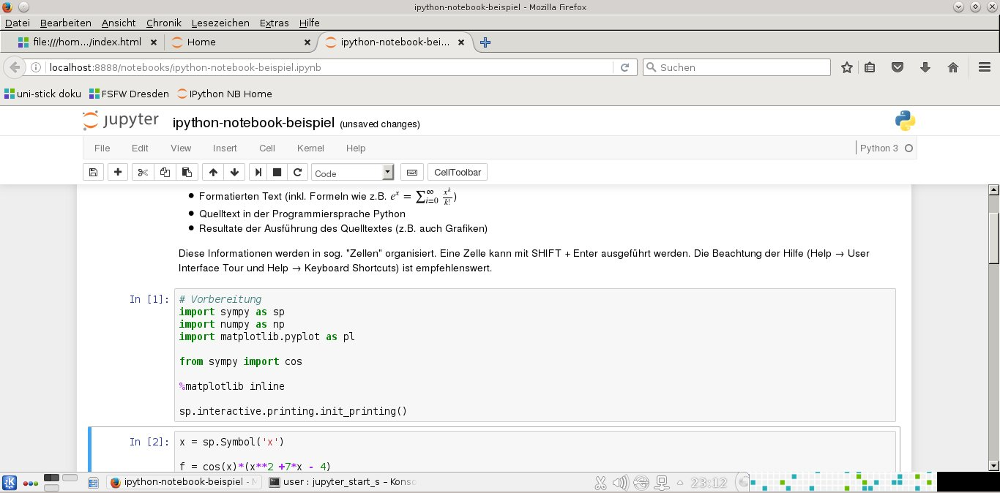

# Hintergrund und Vorgehen

Diese Datei definiert (auszugsweise) das von uns gewünschte Verhalten. Automatisierte Unittests wären deutlich eleganter sind aber technisch zu schwierig.
Jeder trägt die Programme und Funktionen ein, die er/sie für wichtig hält.

# Checkliste
## Desktop (Hintergrund und Symbole)
* Sieht ungefähr so aus: 
 * darauf achten, dass die Uni-Stick-spezifischen Programme räumlich von den allgemeinen Systemprogrammen getrennt sind.

## jupyter

* Klick auf Desktop-Verknüpfung "jupyter-ipython-notebook"; 5s warten
* Konsolenfenster geht auf und Firefox öffnet einen neuen Tab
 * Sieht so aus: 
* Das Beispiel-Notebook lässt sich starten
* Zellen lassen sich ohne Fehlermeldung ausführen (SHIFT + Enter)
* Sieht so aus (nur die ersten 2 Zellen ausgeführt): 

## zim
* Es ist eine Desktop-Verknüpfung dafür vorhanden
* Beim Starten wird die FSFW-zim-Vorlage geöffnet
* Sieht so aus: 
* Über das Menü: Einfügen -> Gleichung bzw. `ALT+E` `G` erreicht man den Dialog zum einfügen von LaTeX-Formeln
 * folgender String sollte ein sinnvolles Ergebnis liefern: `\alpha^2 + \beta = \frac{\pi}{2}`

## Tastenkombinationen

* WIN+T: öffnet ein Terminal
* WIN+K: öffnet KSnapshot (Programm für Bildschirmfotos)
