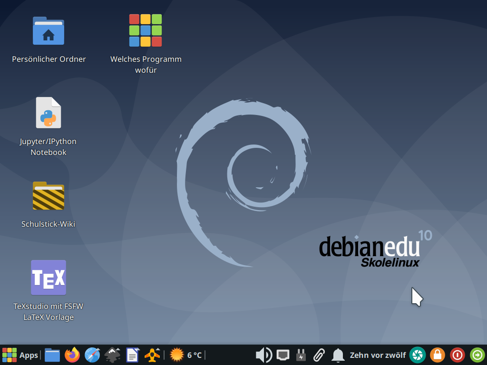

# Der Freie-Software-Freies-Wissen-Schulstick

- eine Lern-, Spiel- und Arbeitsplattform für Schüler von der Grundschule bis zum Abschluss
- mit aktueller Freier Software für viele Anwendungsbereiche
- eigenes Betriebssystem in der Tasche: lässt sich unabhängig von und ohne Gefahr für auf einem Rechner installierter Software starten
- einfache Benutzeroberfläche und verständliche Dokumentation
- Nachinstallieren weiterer Programme möglich
- mit automatischen Sicherheitsupdates
- Funktion, den Stick bei Problemen komplett oder teilweise zurückzusetzen
- erweiterbar und anpassbar, z.B. auf spezielle Bedürfnisse einer Schule (Stichwort »Schul-Proxy«…)

## Download und Bespielen eines USB-Sticks
(Sobald die 6.9 GiB Image-Datei hochgeladen ist, wird hier die URL eingetragen ..)
Die aktuelle Version (FSFW-Schulstick-2020-03-31) basiert auf Debian-Linux 10 (stable, codename »buster«) und dem Xfce-Desktop.

Für die Installation des FSFW-Schulsticks braucht es einen 16GiB-USB-Stick guter Qualität. Weiterhin braucht man ein spezielles Programm, um das Bespielen durchzuführen. Wir empfehlen dafür den [Etcher](https://www.balena.io/etcher/), den es dort für verschiedene Betriebssysteme zum Download gibt.

Damit einfach die komprimierte Image-Datei auswählen und auf den Stick "flashen".

## Verbesserungsvorschläge

Falls Probleme auftreten, ihr eine Funktion vermisst oder eine Idee habt, wie man etwas besser machen kann: einfach hier auf der Github-Projekt-Seite oben unter "Issues" suchen oder einen neuen Fall anlegen.
